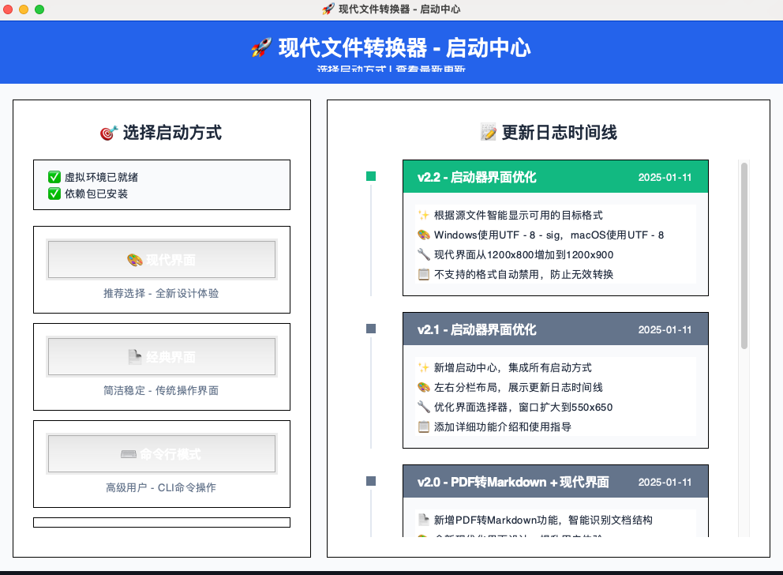
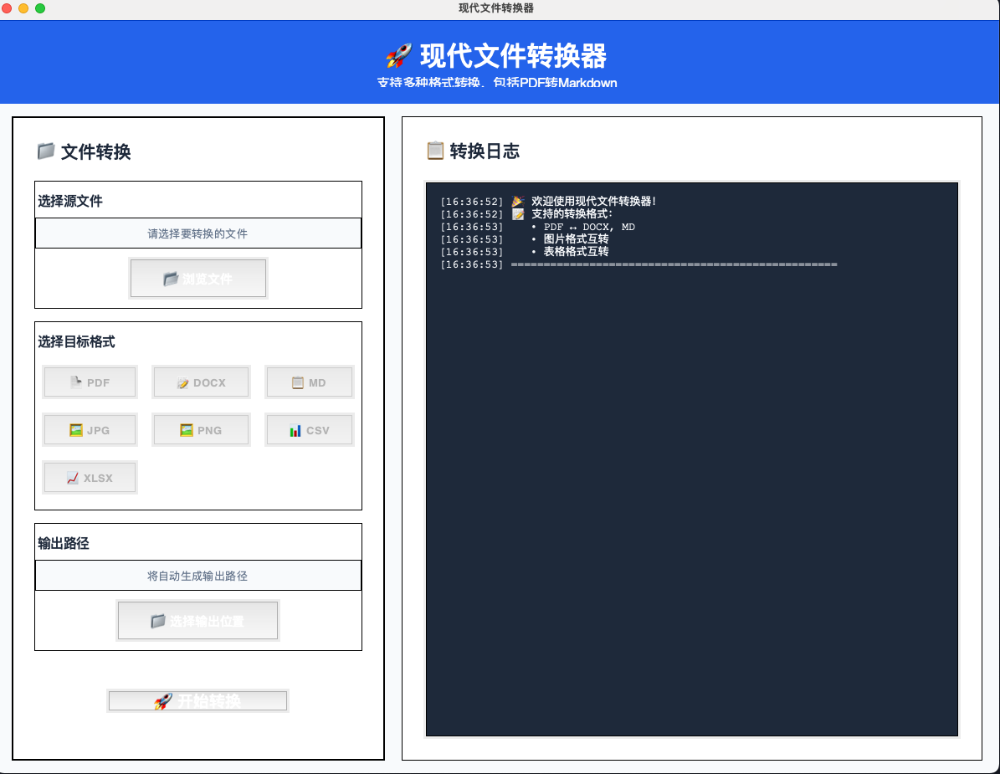

# 🚀 现代文件转换器

这是一个基于Python开发的跨平台文件转换工具，支持Windows和macOS系统。现在包含全新的现代化界面和PDF转Markdown功能！

<div align="center" style="display: flex; gap: 20px; justify-content: center; flex-wrap: wrap;">
  
  
</div>
<br>
## ✨ 最新功能

### 🎨 现代化界面
- **全新设计**：采用现代化设计风格，更加美观易用
- **交互提升**：更直观的操作流程和视觉反馈
- **双界面选择**：可选择现代界面或经典界面

### 📋 PDF转Markdown (新增!)
- **智能转换**：自动识别标题、列表等结构
- **格式保留**：尽可能保持原文档的层次结构
- **文本优化**：优化排版，生成易读的Markdown

## 🚀 快速开始

### 安装依赖
```bash
# 激活虚拟环境
source venv/bin/activate

# 安装依赖包
pip install -r requirements.txt
```

### 启动应用
```bash
# 方式1：一键启动（推荐）
python start.py

# 方式2：界面选择器
python launcher.py

# 方式3：直接启动现代界面
python modern_ui.py

# 方式4：直接启动经典界面
python main.py

# 方式5：命令行模式
python cli.py --help
```

## 📁 支持的文件格式

### 文档类
- **PDF ↔ DOCX**
- **PDF → Markdown** ✨ 新增功能

### 图像类
- **JPG/JPEG ↔ PNG ↔ GIF ↔ BMP**
- **图像 → PDF**

### 表格类
- **CSV ↔ XLSX**
- **CSV/XLSX → PDF**

## 🎯 功能特性

- **多格式支持**：支持文档、图像、表格等多种文件格式转换
- **现代界面**：基于tkinter的现代化图形用户界面
- **经典界面**：保留原有的简洁界面风格
- **跨平台**：支持Windows和macOS系统
- **实时反馈**：转换过程中显示进度和详细日志信息
- **智能推荐**：根据源文件类型智能推荐目标格式

## 🔧 使用说明

1. 运行 `python start.py` 一键启动（推荐）
2. 或运行 `python launcher.py` 启动界面选择器
3. 选择现代界面或经典界面
4. 点击"浏览文件"选择要转换的源文件
5. 选择目标格式（支持按钮点击选择）
6. 选择输出位置（可自动生成）
7. 点击"开始转换"
8. 查看转换日志和结果

## 📦 系统要求

- **Python 3.7+**
- **Windows 10+ 或 macOS 10.14+**
- **依赖包**：见 requirements.txt

## 🛠 技术架构

- **GUI框架**：tkinter
- **图像处理**：Pillow (PIL)
- **文档处理**：python-docx, PyPDF2, reportlab
- **表格处理**：pandas, openpyxl
- **打包工具**：PyInstaller

## 📂 项目结构

```
ftr/
├── start.py                 # 一键启动入口（推荐）
├── launcher.py              # 界面选择器
├── modern_ui.py             # 现代化界面
├── main.py                  # 经典界面
├── cli.py                   # 命令行版本
├── file_converter.py        # 核心转换模块
├── requirements.txt         # 依赖包列表
├── build_windows.bat        # Windows打包脚本
├── build_macos.sh           # macOS打包脚本
└── README.md               # 项目说明文档
```

## 🚀 打包可执行文件

### Windows
```bash
build_windows.bat
```

### macOS
```bash
chmod +x build_macos.sh
./build_macos.sh
```

打包后的可执行文件将在 `dist` 目录中。

## 📝 更新日志

### v2.2 - 界面和兼容性修复版本
- ✅ **窗口高度修复**：现代界面从1200x800增加到1200x900
- ✅ **动态格式展示**：根据源文件智能显示可用的目标格式
- ✅ **编码兼容性**：Windows使用UTF-8-sig，macOS使用UTF-8
- ✅ **智能按钮状态**：不支持的格式自动禁用，防止无效转换

### v2.1 - 启动器界面优化
- ✅ **启动器优化**：窗口从400x300扩大到550x650
- ✅ **卡片设计**：现代化的界面选择体验
- ✅ **功能展示**：详细的特性介绍和使用指导

### v2.0 - 现代化版本
- ✅ **PDF转Markdown**：智能识别文档结构
- ✅ **现代界面**：全新的UI设计和交互体验
- ✅ **界面优化**：修复显示问题，提升可用性
- ✅ **按钮优化**：改进颜色对比度和布局

## ⚠️ 注意事项

1. 某些复杂的PDF文件转换可能会丢失格式信息
2. 图像转换会尽可能保持原始质量
3. 大文件转换可能需要较长时间，请耐心等待
4. 建议在转换前备份重要文件

## 🐛 故障排除

如果遇到转换失败：
1. 检查源文件是否完整且未损坏
2. 确保有足够的磁盘空间
3. 验证输出路径是否有写入权限
4. 查看转换日志中的错误信息

## 📄 许可证

本项目采用 Apache 2.0 许可证。详情请参阅 [LICENSE](LICENSE) 文件。

### 许可证摘要
- ✅ 商业使用
- ✅ 修改
- ✅ 分发
- ✅ 专利使用
- ✅ 私人使用
- ⚠️ 需要包含许可证和版权声明
- ⚠️ 需要说明修改内容

---

**🎉 感谢使用现代文件转换器！**  
如有问题或建议，欢迎反馈。