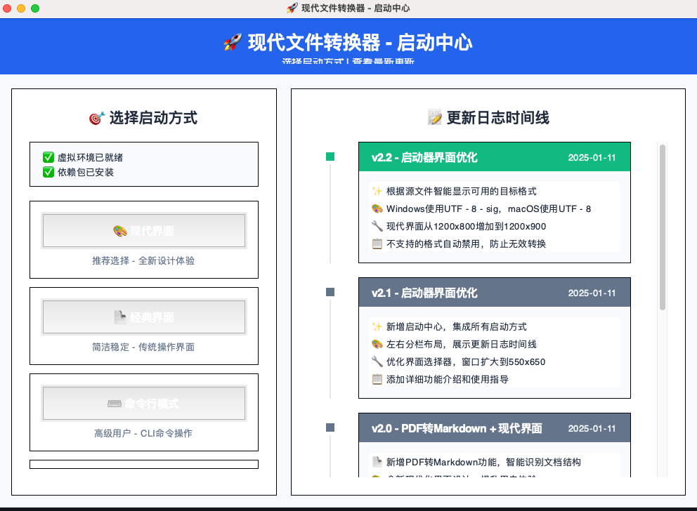

# 🚀 现代文件转换器

> 现代化的文件转换工具 | A modern and powerful file conversion tool

[中文版本](README_zh.md) | [English Version](README.md)

这是一个基于Python开发的跨平台文件转换工具，支持Windows和macOS系统。现在包含全新的现代化界面和PDF转Markdown功能！

<div align="center" style="display: flex; gap: 20px; justify-content: center; flex-wrap: wrap;">
  
  
</div>

## ✨ 功能特性

### 🎨 现代化界面
- **全新设计**：采用现代化设计风格，更加美观易用
- **交互提升**：更直观的操作流程和视觉反馈
- **双界面选择**：可选择现代界面或经典界面

### 📋 PDF转Markdown (新增!)
- **智能转换**：自动识别标题、列表等结构
- **格式保留**：尽可能保持原文档的层次结构
- **文本优化**：优化排版，生成易读的Markdown

### 🔄 动态格式检测
- **智能识别**：根据源文件类型自动显示可用转换格式
- **状态管理**：不支持的格式自动禁用，防止无效转换
- **实时反馈**：提供转换过程中的详细信息

### 🌍 跨平台兼容
- **编码处理**：Windows使用UTF-8-sig，macOS使用UTF-8
- **平台优化**：针对不同操作系统进行优化
- **一致体验**：在不同平台上提供相同的用户体验

## 📦 系统要求

- **Windows**: Windows 10 及以上版本
- **macOS**: macOS 10.14 (Mojave) 及以上版本
- **Python**: 3.7+ (源码运行时)
- **依赖包**: 见 requirements.txt

## 🚀 安装与使用

### 方式1：下载预构建执行文件

1. 从发布页面下载适合您平台的最新版本
2. 解压文件（Windows）或复制 .app 应用程序包（macOS）
3. 运行可执行文件

### 方式2：从源码构建

#### 前提条件
- Python 3.7 或更高版本
- pip 包管理器

#### 安装步骤
```bash
# 克隆仓库
git clone [repository-url]
cd ftr

# 安装依赖
pip install -r requirements.txt

# 运行应用程序
python start.py
```

#### 构建可执行文件

**Windows环境：**
```bash
# 运行构建脚本
build_windows_new.bat
```

**macOS环境：**
```bash
# 给脚本添加执行权限
chmod +x build_macos_new.sh

# 运行构建脚本
./build_macos_new.sh
```

**跨平台构建：**
```bash
# 使用统一构建脚本
python build_cross_platform.py
```

## 🎯 使用方法

### 启动应用
```bash
# 方式1：一键启动（推荐）
python start.py

# 方式2：界面选择器
python launcher.py

# 方式3：直接启动现代界面
python modern_ui.py

# 方式4：直接启动经典界面
python main.py
```

### 转换文件
1. **启动应用程序**
   - 双击可执行文件
   - 选择您喜欢的界面（经典或现代）

2. **选择源文件**
   - 点击"浏览"选择输入文件
   - 系统将自动检测支持的格式

3. **选择目标格式**
   - 可用的转换选项将会显示
   - 选择您想要的输出格式

4. **开始转换**
   - 点击"开始转换"
   - 在状态栏中监控进度
   - 在同一目录中找到转换后的文件

## 📁 支持的文件格式

### 文档转换
- **PDF ↔ DOCX**: 双向文档转换
- **PDF → Markdown**: 智能格式化转换为Markdown

### 图像转换
- **JPG ↔ PNG ↔ GIF ↔ BMP**: 图像格式间转换
- **TIFF → JPG/PNG**: 将TIFF图像转换为常见格式

### 表格转换
- **CSV ↔ XLSX**: CSV和Excel格式互转
- **XLS → XLSX**: 升级旧版Excel文件

## 🛠 技术架构

### 核心技术
- **Python 3.13** - 核心应用语言
- **Tkinter** - GUI框架
- **PyPDF2** - PDF处理
- **Pillow** - 图像处理
- **pandas** - 数据处理
- **python-docx** - Word文档处理
- **ReportLab** - PDF生成

### 架构设计
- 模块化设计，界面与转换逻辑分离
- 线程安全的文件操作
- 动态格式检测系统
- 跨平台编码管理

## 📂 项目结构

```
ftr/
├── start.py                 # 主应用程序启动器
├── modern_ui.py             # 现代化界面实现
├── file_converter.py        # 核心转换逻辑
├── launcher.py              # 界面选择器
├── requirements.txt         # Python依赖
├── build_cross_platform.py  # 构建脚本
└── README.md               # 说明文档
```

## 📝 版本历史

### v2.2.0 (当前版本)
- ✅ PDF转Markdown功能
- ✅ 现代化UI重设计
- ✅ 动态格式检测
- ✅ 跨平台编码修复
- ✅ 统一打包系统

### v2.1.0
- ✅ 现代界面选项
- ✅ 改进的文件格式支持
- ✅ 增强的错误处理

### v2.0.0
- ✅ 完整的UI重设计
- ✅ 多格式支持
- ✅ 改进的转换精度

## 🐛 故障排除

如果遇到转换失败：
1. 检查源文件是否完整且未损坏
2. 确保有足够的磁盘空间
3. 验证输出路径是否有写入权限
4. 查看转换日志中的错误信息

## 📄 许可证

本项目采用 MIT 许可证。详情请参阅 [LICENSE](LICENSE) 文件。

### 许可证摘要
- ✅ 商业使用
- ✅ 修改
- ✅ 分发
- ✅ 私人使用
- ⚠️ 需要包含许可证和版权声明

## 🎉 致谢

- 感谢所有贡献者和测试者
- 特别感谢Python社区提供的优秀库
- UI设计灵感来自现代应用程序标准

---

**🚀 现代文件转换器** - 让文件转换变得简单而美丽